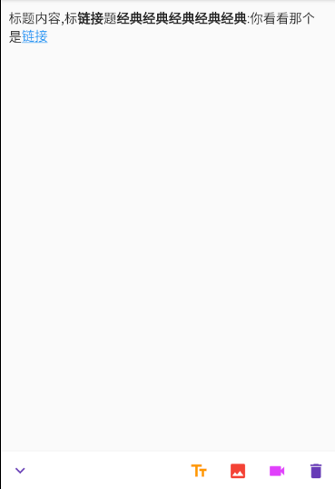

<!-- @IGNORE PREVIOUS: link -->

# 介绍

该插件属于`实验性`，并且当前状态`未完成开发`，慎重使用。

可编辑富文本，能与图片、视频、文字混合使用。

特点:
- 可以将编辑器视图与工具栏摆放在任意位置。
- 可自定义toolbar控件，每个Toolbaritem都有自己独立选项，包括自定义widget，颜色，大小等。
- 可定义编辑器内部特殊labelWidget。
- 随时更改rich-html标签支持。

支持的标签：

| 名称  | 版本   |
|:------|:------|
| p     | 0.0.1 |
| b     | 0.0.1 |
| a     | 0.0.1 |
| video | 0.0.1 |
| img   | 0.0.1 |

如果需支持更多可以克隆该项目，修改内部实现:D, 当然也您乐意在github仓库内提出意见。

## 入门使用

我们使用一份简单例子来展示ridh-html,通过github地址引用插件。

```pubspec.yaml
dependencies:
    # rich-html插件
    # tip: 如果下载过于缓慢,请修改dns
    flutter_rich_html:
        git:
            path: git://github.com/cabbagelol/rich_html-d20822.git
            
    # 以下插件并非flutter_rich_html依赖
    chewie: any
    video_player: any
    image_picker: any     
```

继承RichHtmlController类, 重写generateVideoView这类方法。

```dart
class MySimpleRichHtmlController extends RichHtmlController {
  final context;
  
  MySimpleRichHtmlController(this.context);

  /// [insertVideo] 和[insertImage] 用于在触发上传或选择文件后返回
  /// 插入视频
  @override
  Future<String> insertVideo() async {
    return "https://www.w3school.com.cn/i/movie.mp4";
  }

  /// 重写generateVideoView改变rich-html内部特殊标签的实际weiget
  /// 视频实际显示
  @override
  Widget generateVideoView(String url, viedo) {
    return VideoView(
      url: url,
    );
  }

  @override
  noSuchMethod(Invocation invocation) {
    return super.noSuchMethod(invocation);
  }
}
```
RichHtmlController下的：

|                   | 描述              | 类型           | 支持版本 |
|:------------------|:------------------|:--------------|:---------|
| insertImage       | 插入图片地址       | String        | 0.0.1   |
| insertVideo       | 插入视频地址       | String        | 0.0.1   |
| generateImageView | 生成图片Widget     | Widget        | 0.0.1   |
| generateVideoView | 生产视频Widget     | Widget        | 0.0.1   |
| theme             | rich-html主题设定  | RichHtmlTheme | 0.0.1   |
| text              | 值(不包含html标签) | String        | 0.0.1   |
| html              | 值                | String        | 0.0.1    |
| *textSelection*   | 选择器             | TextSelection | 0.0.1   |
| *updateWidget*    | 主动更新内部Widget | Function      | 0.0.1   |
| clearAll          | 清空文本           | Function      | 0.0.1   |

实例一个刚刚创建的MySimpleRichHtmlController，完整应该是这样;

```dart
MySimpleRichHtmlController controller;

@override
void initState() {
    super.initState();
    
    controller = MySimpleRichHtmlController(context)..html =
    """
      这是一个示例, 用于展示rich-html,<a>查看</a>
    """;
}

@override
Widget build(BuildContext context) {
  return Colum(
    children: [
      Container(
        height: 300,
        child: RichHtml(controller),
      ),
      RichHtmlToolBar(
        controller,
        children: [
          RichHtmlToolSizedBox(
            flex: 1,
          ),
          RichHtmlToolVideo(
            color: Colors.red,
          ),
        ],
      ),
    ],
  );
}
```
<a href="example/lib/main.dart">详情例子</a>

